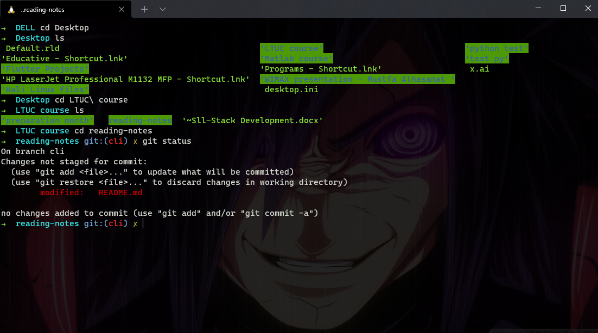

# CLI commands

> [Back to the main](./README.md)

- Changing directory:

        >> cd Folder 

    it will go to that folder’s directory

        >> cd Desktop/Test/Folder 

    it will follow that path and go to that folder’s directory

        >> cd Folder one

    it will raise an error, because we can’t write a directory’s name with more than one syllable (we have to use double quotes)

        >> cd “Folder one”

    it will got to that directory, we use the double quotes to enter names with more than one syllable 

        >> cd ‘Folder one’

    it will got to that directory, we can also use the single quotes 

        >> cd Folder\ one

    it will got to the directory (Folder one), we can also use the backslash 

        >> cd .

    it will keeps you in the current directory (do nothing, because the dot refers to the current directory)

        >> cd ..

    it will go back to the previous directory (because the double dots refer to the previous directory)

        >> cd 

    it will take you to the root directory 

        >> ~

    (the tilde is a shortcut for your root directory) it will take you to the root directory 

        >> cd\ 

    it will change the directory to the drive itself

        >> G: 

    (we don’t need to type cd\ before this line) It will change the directory to the drive (G)

---

- Listing

        >> ls 

    (“dir” in windows) it listed the contents of our current directory

        >> ls Folder

    it will list the contents of the (Folder) directory

        >> ls Desktop/Test/Folder

    we can provide a path ended with the directory we want to list its contents 

        >> ls -l

    give us more details about each component by doing a long listing, it has the following:

1. First character indicates whether it is a normal file ( - ) or directory ( d )
2. Next 9 characters are permissions for the file or directory
3. The next field is the number of blocks 
4. The next field is the owner of the file or directory  
5. The next field is the group the file or directory belongs to 
6. The next field is the file size
7. The next field is the file modification time
8. Finally we have the actual name of the file or directory

        >> ls /etc

    it won’t list our current directory but instead it will list the directories contents

        >> ls -l /etc

    we can combine both of them

        >> ls -a

    displays all components including hidden files 

---

- Useful commands

        >> echo $SHELL

    it will display the shell you’re working on it

        >> pwd

    (print working directory) it will print the current directory 

        >> man ls

    shows the manual page for the command (ls), we can type any CLI command

        >> clear

    (we can use “cls”) it will clear the screen 

        >> du -sh ./*  

    find the size of every directory in your current directory

        >> df -h 

    display how much disk space is used and also free

        >> basename -s .jpg -a *.jpg | xargs -n1 -i cp {}.jpg {}_original.jpg

    make a copy of every jpg image file in the current directory and rename adding _original

        >> find /home -mtime -1 

    find all files in the given directory (and subdirectories) which have been modified in the last 24 hours.

        >> shutdown -h now 

    shutdown the system

        >> shutdown -r now 

    reboot the system

---

- Modifying and manipulation tools

    - Creating files or directories

            >> mkdir Folder

        it will make a new directory(folder) in the current one

            >> mkdir “New Folder”

        create new directory if its name contains spaces

            >> mkdir New\ Folder

        create new directory if its name contains spaces

            >> mkdir -p Folder/Test/”Testing Python”

        the (-p) tells the CLI to create a series of parent directories inside each other, so now we created three cascaded folders (Folder/Test/Testing Python)

            >> mkdir -pv Folder/Test/”Testing Python”

        the (-v) tells the CLI to tell us what does he has done (creating the folders)

            >> touch test.txt

        create new file

        ---

    - Deleting files or directories 

            >> rmdir Folder 

        it will delete the directory (Folder) only if it is empty

            >> rmdir -r Folder 

        it will delete the directory (Folder) even if it is not empty (we use (-r) to indicate to the recursive process which means go through all its files and subdirectories)

            >> rm -r Folder

        deletes the directory (Folder)

            >> rm test.txt

        deletes the file (test.txt)

        ---

    - Copy/Cut Paste

            >> cp test.txt Desktop/Test

        it will copy the file (test.txt) and paste it inside the (Folder) that is located in the path (Desktop/), we must provide a full path for both the source and the destination 

            >> cp -r myFolder Desktop/Test

        we use the (-r) to copy the directories

            >> mv test.txt Desktop/Test

        it will cut the file (test.txt) and paste it inside the (Folder) 

---

- Other tools

        >> nano test.txt

    opens a specific text file to edit it 

        >> sudo mkdir Folder

    we can add the term “sudo” to force running any command if the system prevented us to run for any permission reasons 

        >> code .

    it will open VSCode in the current directory

        >> netstat -aon

    it will show us the open ports 

        >> netstat -ab

    it will show us a live updates about the open ports 

---

- Useful shortcuts

    - Tab :

        We can use the (Tab) key to auto fill the name of file or directory we are typing

    - Ctrl + c :

        cancel the currently running process

    - kill (process id) :

        cancel the given process, we can include the option -9 to kill a stubborn process

    - ps :

        obtain a listing of processes and their id's, including the option aux will show all processes

    - Ctrl + z :

        pause the currently running process and put it in the background

    - Jobs :

        see a list of current processes in the background

    - fg (job number) :

        move the given process from the background to the foreground

---
