# Reading Notes - Mustafa Alahasanat

A track for my observations and questions from the reading assignments throughout the ASAC python course.

---

## Code 102 - Intro to Software Development

---

## Code 201 - Foundations of Software Development

---

## Code 301 - Intermediate Software Development

---

## Code 401 - Advanced Software Development

- > MySQL notes

    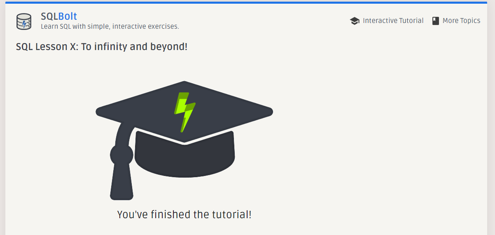

  - The "USE" statement
  
        USE database1

    it opens the selected database (schema)

    ---

  - The "SELECT, FROM" statement

        SELECT col1 FROM table1

    it opens a column from a table

        SELECT col1, col2, col3 FROM table1

    it opens specific columns from a table

        SELECT * FROM table1

    it opens all columns from a table

    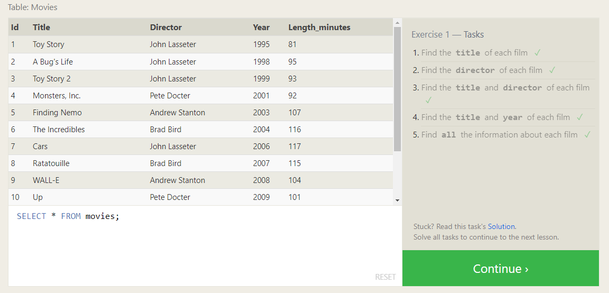

    ---

  - The "WHERE" statement

        SELECT * FROM table1 WHERE col1 = 1

    it filters the results for only rows who have the column (col1) has the value (1)

        SELECT * FROM table1 WHERE col1 > 300

    it filters the results for values greater than 300 we can use any comparison sign:

    1. ">"
    2. "<"
    3. ">="
    4. "<="
    5. "="
    6. "!=" or "<>"

            SELECT * FROM table1 WHERE col1 = “apple”

    it is a filter for string data types 

        SELECT * FROM table1 WHERE col1 > “1998-09-24”

    it is a filter for date data types, this one display the cells with a date after 24-9-1998 (this is the default format for representing dates in SQL, it takes 4 digits for the year, 2 digits for the month, and 2 for the day)

    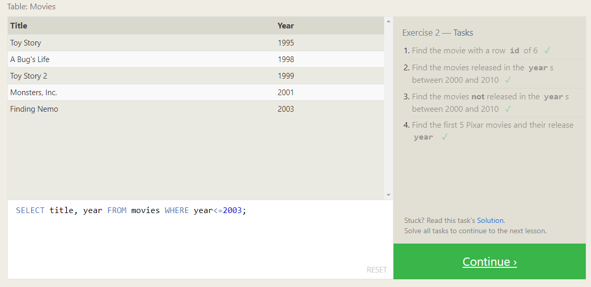

    ---

  - The "AND, OR, NOT" statements

        SELECT * FROM table1 WHERE col1 = “apple” OR col4 < 20  

    we can combine multiple conditions using: AND, OR, NOT

        SELECT * FROM table1 WHERE (col1 = “apple” OR col4 < 20) AND NOT col3 =0

    we can use brackets to cascade conditions

    ---

  - The "IN" statement

        SELECT * FROM table1 WHERE col2 IN (20, 40, 60)  

    we can use the (IN) word to write multiple (OR) conditions, the previous statement is equivalent to this:

    SELECT * FROM table1 WHERE col2 = 20 OR col2 = 40 OR col2 = 60  

        SELECT * FROM table1 WHERE col2 NOT IN (20, 40, 60)  

    we can use the (NOT) in here to get results outside that condition

    ---

  - The "BETWEEN" statement

        SELECT * FROM table1 WHERE col3 BETWEEN 100 AND 300

    we can use the (BETWEEN) word to write a range filter using the (AND) operator, the previous statement is equivalent to this:
    SELECT * FROM table1 WHERE col3 >= 100 AND col3 <= 300

    ---

  - The "LIKE" statement

        SELECT * FROM table1 WHERE col3 LIKE “b%”

    get all the cells where the value of (col3) starts with the letter ( b ) upper and lower cases

        SELECT * FROM table1 WHERE col3 LIKE “%b%”

    get all the cells who have the letter ( b ) in their string

        SELECT * FROM table1 WHERE col3 LIKE “%b”

    get all the cells who ends with the letter ( b ) in their string

        SELECT * FROM table1 WHERE col3 LIKE “_b”

    cells that have ( b ) as the second character in their string (number of underscores indicates the number of voids we want in our filter)

        SELECT * FROM table1 WHERE col3 LIKE “___b”

    cells that have ( b ) as the forth character in their string (because we have 3 underscores)

        SELECT * FROM table1 WHERE col3 LIKE “m____b”

    cells that have ( m ) as the first character and ( b ) as the sixth one (because we have 4 underscores in between)

    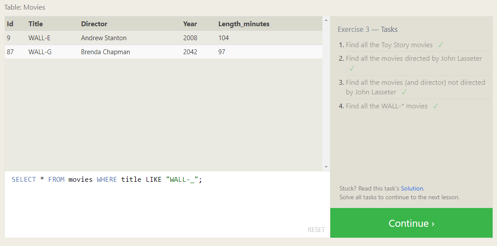

    ---

  - The "ORDER BY" statement

        SELECT * FROM table1 ORDER BY col1 

    it will sort the results alphabetically by the components of the column (col1)

        SELECT * FROM table1 ORDER BY col1 ASC

    it will sort the results ascendant 

        SELECT * FROM table1 ORDER BY col1 DESC

    it will sort the results descendant

    ---

  - The "LIMIT, OFFSET"

        SELECT * FROM table1 LIMIT 5 

    it will display the first 5 rows from the table

        SELECT * FROM table1 OFFSET 3 

    it will display rows starting from the third one till the end

        SELECT * FROM table1 LIMIT 5 OFFSET 3 

    it will display the first 5 rows from the table starting from the third one (3, 4, 5, 6, 7)

    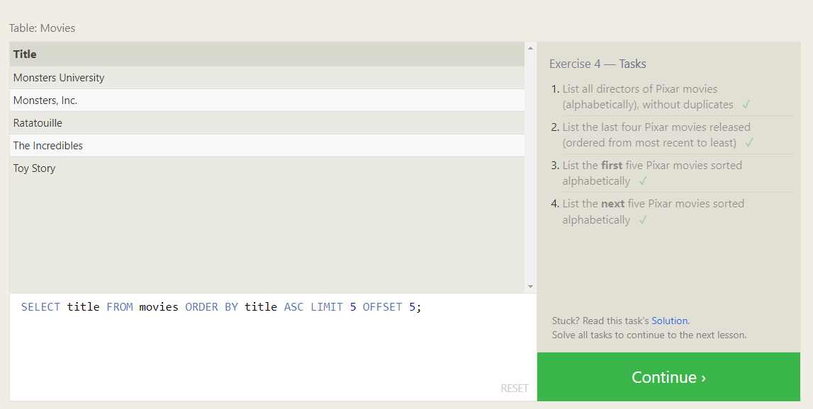

    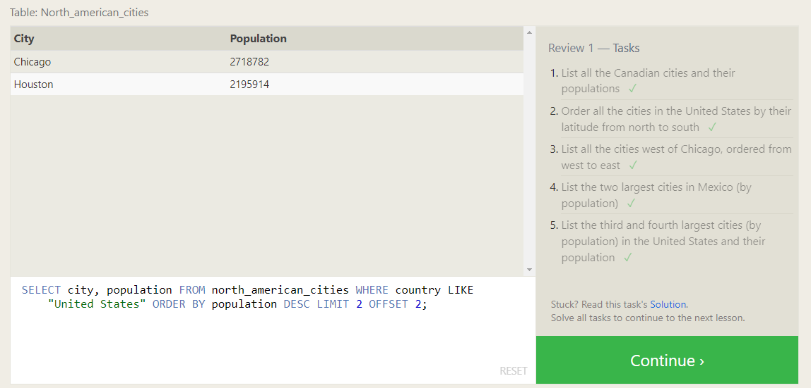

    ---

  - The "DISTINCT" statement
  
        SELECT DISTINCT col1 FROM table1

    it hides all the duplicates and will only display one of each unique data without any duplicates  

    ---

  - The "JOIN, ON" statement

        SELECT * FROM table1 JOIN table2 ON table2.col2 = table1.col1

    we use the (JOIN) word to extract the common cells for specific two columns (from two different tables), it is important to place each one

    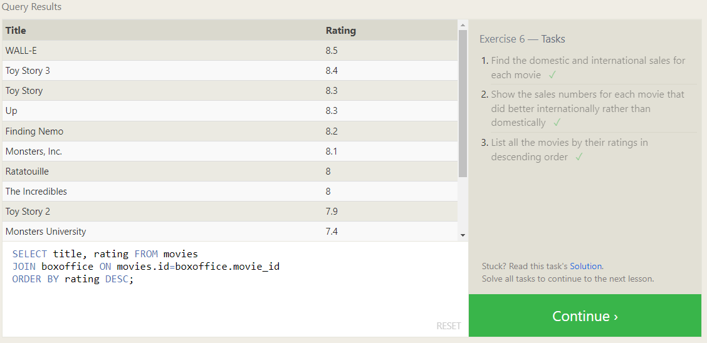

    ---

  - The "INSERT INTO, VALUES" statement

        INSERT INTO table1 (col1, col2, col3) VALUES (val1, val2, val3)

    this will insert a new row in the table and fill its specified columns with the provided values, all required columns must be filled with a suitable values, also number of values must equal number of columns

        INSERT INTO table2 VALUES (val1, val2, val3)

    when we insert in a joined table (suppose table2 is joined with another), we don’t have to specify the columns

    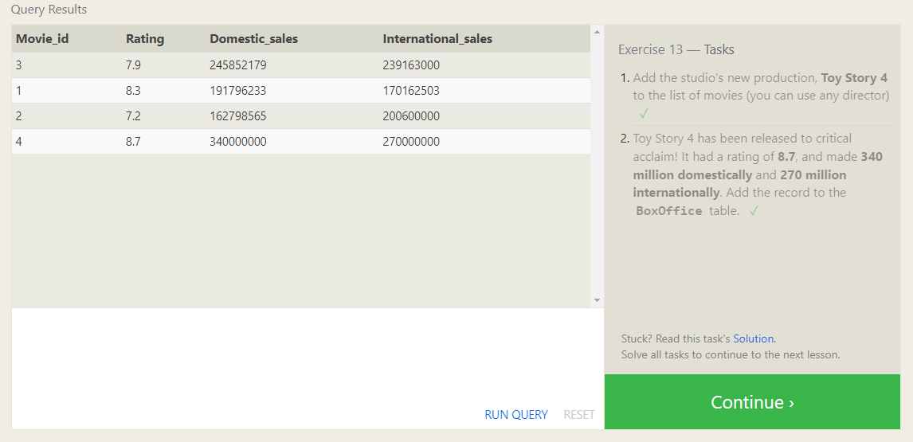

    ---

  - The "UPDATE" statement

        UPDATE table1 SET col1=”hello", col4=500 WHERE id=11

    it will update the specified columns with the new values

    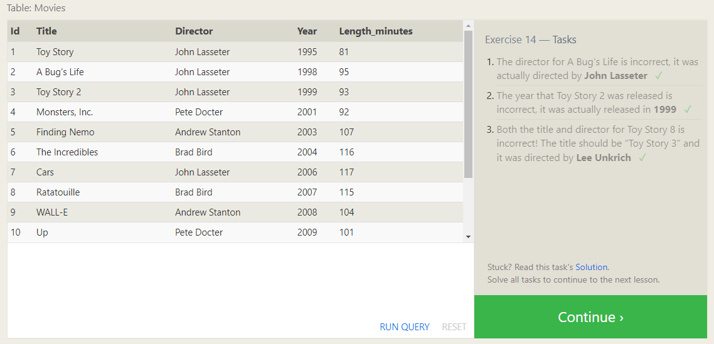

    ---

  - The "DELETE, FROM" statement

        DELETE FROM table1 WHERE col3<200

    it will delete all the rows which have a value for (col3) less than 200

    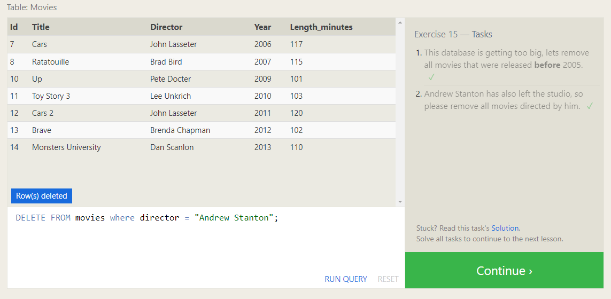

    ---

  - The "CREATE" statement

        CREATE TABLE IF NOT EXISTS table1 ( 
        id INTEGER PRIMARY KEY,
        col2 TEXT DEFAULT “now”,
        col3 FLOAT, 
        );

    it will create a table with 3 columns: id (a primary key integer), col2 (a string with a default value “now”), col3 (a float)

    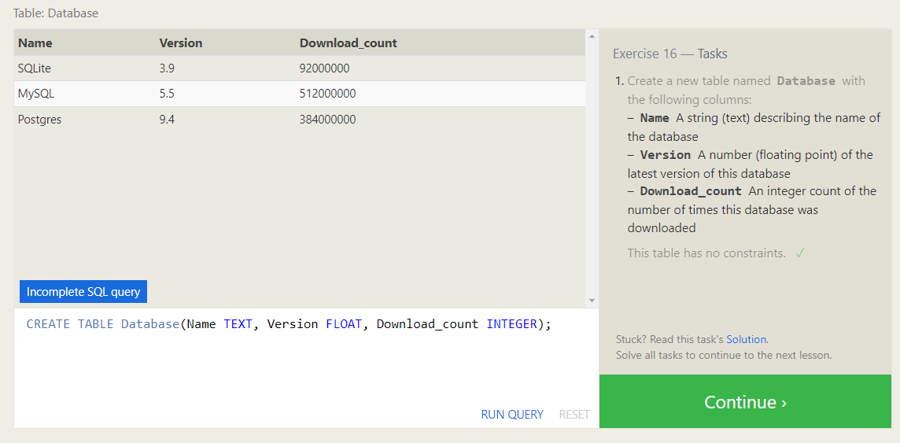

    ---

  - The "DROP" statement

        DROP TABLE IF EXISTS table1

    it will delete the whole table

    ---

  - The "ALTER" statement

    we use it to modify the schema itself (its tables and their constraints and data types)

    - The "ADD" statement

            ALTER TABLE table1 ADD col7 INTEGER DEFAULT 0

        this will add a new column (col7) to the table with the type (integer) and has a default value of (0)

        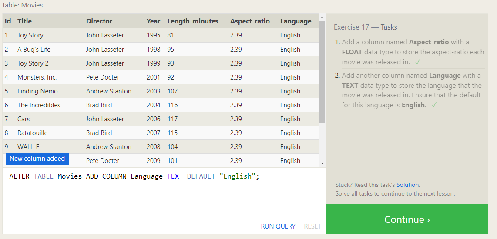

        ---

    - The "DROP" statement

            ALTER TABLE table1 DROP col7

        this will delete the whole column (col7)

        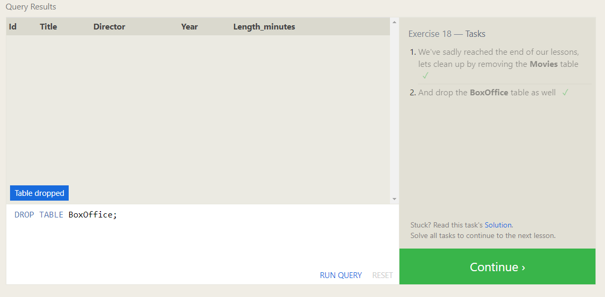

        ---

    - The "RENAME" statement

            ALTER TABLE table1 RENAME TO table2

        this will rename the whole table to (table2)

        ---

  - Arithmetic operations

        SELECT (myGrades + 10) * 100 FROM table1

    it will apply the operation on all the cells in that table and present it as a new untitled table

        SELECT (myGrades + 10) * 100 AS newGrades FROM table1

    it will apply the operation and present the results as a new column named (newGrades)

        SELECT (myGrades + 10) * 100 AS “new grades” FROM table1

    if we want to add a space in between the words of the new name (alias), we have to put them inside single or double quotes
  
    ---

  - Data types in MySQL

    1. INTEGER: an integer value (positive or negative or zero)

    2. BOOLEAN: they represented as an integer value of just 0 or 1

    3. FLOAT: a float value (positive or negative)

    4. DOUBLE: a float value with more capacity (positive or negative)

    5. CHARACTER(num): short strings with a limit of the max characters capacity (num), (longer values may be truncated)

    6. VARCHAR(num_chars): (variable character) strings with a limit of the max characters capacity (num), (longer values may be truncated)

    7. TEXT: strings with an unlimited characters capacity

    8. DATE: a variable with the date as a string 

    9. DATETIME: a variable with the date and the time as a string

    10. BLOB: binary data

    ---

  - Constraints

    1. PRIMARY KEY : this means that the values in this column are unique, and each value can be used to identify a single row in this table

    2. AUTOINCREMENT : only for integer values, this means that the value is automatically filled in and incremented with each row insertion

    3. UNIQUE : this means that the values in this column have to be unique, so you can't insert another row with the same value in this column as another row in the table, it differs from the PRIMARY KEY in that it doesn't have to be a key for a row in the table

    4. NOT NULL : this means that the inserted value cannot be NULL

    5. CHECK (expression) : this allows you to run a more complex expression to test whether the values inserted are valid

    6. FOREIGN KEY : this is a consistency check which ensures that each value in this column corresponds to another value in a column in another table, like if there are two tables, one listing people by ID, and another listing their ages, the FOREIGN KEY can ensure that every row in the ages table corresponds to a valid name in the master people list

---

- > CLI commands

  - Changing directory:

        >> cd Folder 

    it will go to that folder’s directory

        >> cd Desktop/Test/Folder 

    it will follow that path and go to that folder’s directory 

        >> cd Folder one

    it will raise an error, because we can’t write a directory’s name with more than one syllable (we have to use double quotes)

        >> cd “Folder one”

    it will got to that directory, we use the double quotes to enter names with more than one syllable 

        >> cd ‘Folder one’

    it will got to that directory, we can also use the single quotes 

        >> cd Folder\ one

    it will got to the directory (Folder one), we can also use the backslash 

        >> cd .

    it will keeps you in the current directory (do nothing, because the dot refers to the current directory)

        >> cd ..

    it will go back to the previous directory (because the double dots refer to the previous directory)

        >> cd 

    it will take you to the root directory 

        >> ~

    (the tilde is a shortcut for your root directory) it will take you to the root directory 

        >> cd\ 

    it will change the directory to the drive itself

        >> G: 

    (we don’t need to type cd\ before this line) It will change the directory to the drive (G)

    ---

  - Listing

        >> ls 

    (“dir” in windows) it listed the contents of our current directory

        >> ls Folder

    it will list the contents of the (Folder) directory

        >> ls Desktop/Test/Folder

    we can provide a path ended with the directory we want to list its contents 

        >> ls -l

    give us more details about each component by doing a long listing, it has the following:

    1. First character indicates whether it is a normal file ( - ) or directory ( d )
    2. Next 9 characters are permissions for the file or directory
    3. The next field is the number of blocks 
    4. The next field is the owner of the file or directory  
    5. The next field is the group the file or directory belongs to 
    6. The next field is the file size
    7. The next field is the file modification time
    8. Finally we have the actual name of the file or directory

            >> ls /etc

    it won’t list our current directory but instead it will list the directories contents

        >> ls -l /etc

    we can combine both of them

        >> ls -a

    displays all components including hidden files 

    ---

  - Useful commands

        >> echo $SHELL

    it will display the shell you’re working on it

        >> pwd

    (print working directory) it will print the current directory 

        >> man ls

    shows the manual page for the command (ls), we can type any CLI command

        >> clear

    (we can use “cls”) it will clear the screen 

        >> du -sh ./*  

    find the size of every directory in your current directory

        >> df -h 

    display how much disk space is used and also free

        >> basename -s .jpg -a *.jpg | xargs -n1 -i cp {}.jpg {}_original.jpg

    make a copy of every jpg image file in the current directory and rename adding _original

        >> find /home -mtime -1 

    find all files in the given directory (and subdirectories) which have been modified in the last 24 hours.

        >> shutdown -h now 

    shutdown the system

        >> shutdown -r now 

    reboot the system

    ---

  - Modifying and manipulation tools

    - Creating files or directories

            >> mkdir Folder

        it will make a new directory(folder) in the current one

            >> mkdir “New Folder”

        create new directory if its name contains spaces

            >> mkdir New\ Folder

        create new directory if its name contains spaces

            >> mkdir -p Folder/Test/”Testing Python”

        the (-p) tells the CLI to create a series of parent directories inside each other, so now we created three cascaded folders (Folder/Test/Testing Python)

            >> mkdir -pv Folder/Test/”Testing Python”

        the (-v) tells the CLI to tell us what does he has done (creating the folders)

            >> touch test.txt

        create new file

        ---

    - Deleting files or directories 

            >> rmdir Folder 

        it will delete the directory (Folder) only if it is empty

            >> rmdir -r Folder 

        it will delete the directory (Folder) even if it is not empty (we use (-r) to indicate to the recursive process which means go through all its files and subdirectories)

            >> rm -r Folder

        deletes the directory (Folder)

            >> rm test.txt

        deletes the file (test.txt)

        ---

    - Copy/Cut Paste

            >> cp test.txt Desktop/Test

        it will copy the file (test.txt) and paste it inside the (Folder) that is located in the path (Desktop/), we must provide a full path for both the source and the destination 

            >> cp -r myFolder Desktop/Test

        we use the (-r) to copy the directories

            >> mv test.txt Desktop/Test

        it will cut the file (test.txt) and paste it inside the (Folder) 

        ---

  - Other tools

        >> nano test.txt

    opens a specific text file to edit it 

        >> sudo mkdir Folder

    we can add the term “sudo” to force running any command if the system prevented us to run for any permission reasons 

        >> code .

    it will open VSCode in the current directory

        >> netstat -aon

    it will show us the open ports 

        >> netstat -ab

    it will show us a live updates about the open ports 

    ---

  - Useful shortcuts

    - Tab :

        We can use the (Tab) key to auto fill the name of file or directory we are typing

    - Ctrl + c :

        cancel the currently running process

    - kill (process id) :

        cancel the given process, we can include the option -9 to kill a stubborn process

    - ps :

        obtain a listing of processes and their id's, including the option aux will show all processes

    - Ctrl + z :

        pause the currently running process and put it in the background

    - Jobs :

        see a list of current processes in the background

    - fg (job number) :

        move the given process from the background to the foreground

---
