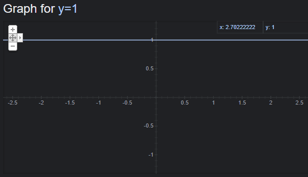
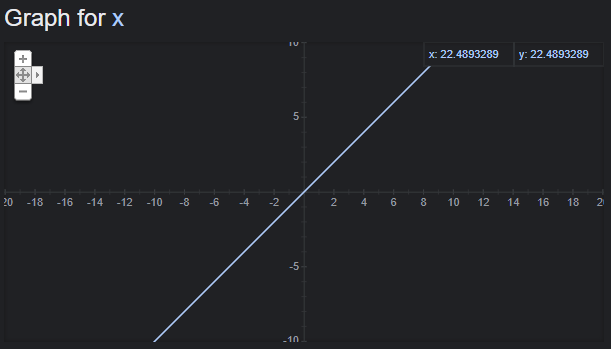
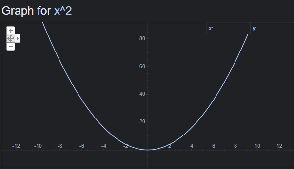
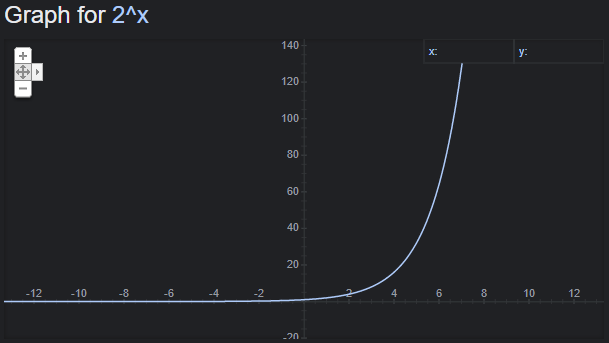

# Reading: Class 01

> [Back to the main](./README.md)

## Pain vs. Suffering

- Pain is a price we pay for self-growth. Whenever we try to learn something new, we have to deal with some mental and physical pain during that trip. But without that pain, the whole trip will lose its puorpose, and we won't feel the taste of victory!

- Suffering, on the other hand, is a meaningless pain. It doesn't have a pourpose and nothing good comes out of it.  

- So, we have to know why are we doing what we doing. We need to be sure that we are doing it because we want to, not just to make someone happy.

---

## Big O Notation

- It's a way we use in computer science to describe the complexity of the solution for a problem. It also has alot of examples.

- O(1) describes an algorithm that will be executed everytime in the same way regardless of the size of the input data.

---

- O(N) describes an algorithm that will grow linearly in proportional directly to the size of the input data.

---

- O(N²) refers to an algorithm that is directly proportional to the square of the size of the input data.

---

- O(2^N) denotes an algorithm whose growth doubles with each addition to the input data set.

---

## Python Environment

- Python
  - it is an interpreted language
  - when we assign a value to any type of variables, it will be assigned to the reference value not the value itself. which means if we changed the reference value of the variable, the value of the variable will be changed too.

    ---

- Python data types
  - Text Type:
    - str: strings
  - Numeric Types:
    - int: integers
    - float: floats
    - complex: complex (imaginary numbers)
  - Sequence Types:
    - list
    - tuple
    - range
  - Mapping Type:
    - dict: dictionaries
  - Set Types:
    - set
    - frozenset
  - Boolean Type:
    - bool: Boolean
  - Binary Types:
    - bytes
    - bytearray
    - memoryview

---

- Set your python environment with these commands:
  - First we install pyenv:
    - curl https://pyenv.run | bash
    - export PATH="~/.pyenv/bin:$PATH"
    - eval "$(pyenv init -)"
    - eval "$(pyenv virtualenv-init -)"
    - pyenv install 3.7.5
    - pyenv global 3.7.5

  - Now we go to poetry:
    - curl -sSL https://raw.githubusercontent.com/sdispater/poetry/master/get-poetry.py | python
    - pyenv virtualenv 3.7.5 tools 
    - pyenv activate tools
    - pip install poetry 
    - pyenv deactivate 
    - pyenv global 3.7.5 tools
    - poetry config settings.virtualenvs.in-project true
    - poetry config virtualenvs.in-project true
    - poetry new dsexample 
    - cd dsexample
    - poetry add pandas=0.25 fastapi --extras all
    - poetry add tf2-utils --git git@github.com:Shawe82/tf2-utils.git
    ---

  - SOme helpful tools : "Black", "mypy", "pre-commit"
    - poetry add --dev black=19.3b0
    - poetry run black .
    - poetry add --dev mypy
    - poetry run mypy .
    - pyenv activate tools
    - pip install pre-commit 
    - pyenv deactivate

    - To use it, you first need to add a config file called (.pre-commit-config.yaml) to the parent level folder of your project. It should has this:

            repos:
            -   repo: https://github.com/ambv/black
                rev: 19.3b0
                hooks:
                - id: black
                language_version: python3.7
            -   repo: https://github.com/pre-commit/mirrors-mypy
                rev: v0.740
                hooks:
                - id: mypy

    - pre-commit install
    - pre-commit run --all-files

---
